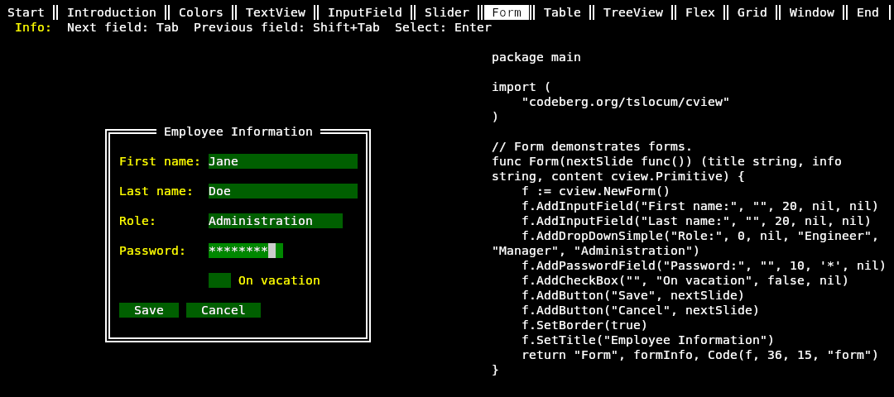

# gview - Terminal-based user interface toolkit
[](https://pkg.go.dev/github.com/gvcgo/gview)
[](https://liberapay.com/rocket9labs.com)

This package is a fork of [tview](https://github.com/rivo/tview).
See [FORK.md](FORK.md) for more information.

## Demo

`ssh cview.rocket9labs.com -p 20000`

[](demos/presentation)

## Features

Available widgets:

- __Input forms__ (including __input/password fields__, __drop-down selections__, __checkboxes__, and __buttons__)
- Navigable multi-color __text views__
- Selectable __lists__ with __context menus__
- Modal __dialogs__
- Horizontal and vertical __progress bars__
- __Grid__, __Flexbox__ and __tabbed panel layouts__
- Sophisticated navigable __table views__
- Flexible __tree views__
- Draggable and resizable __windows__
- An __application__ wrapper

Widgets may be customized and extended to suit any application.

[Mouse support](https://pkg.go.dev/github.com/gvcgo/gview#hdr-Mouse_Support) is available.

## Applications

A list of applications powered by gview is available via [pkg.go.dev](https://pkg.go.dev/github.com/gvcgo/gview?tab=importedby).

## Installation

```bash
go get github.com/gvcgo/gview
```

## Hello World

This basic example creates a TextView titled "Hello, World!" and displays it in your terminal:

```go
package main

import (
	"github.com/gvcgo/gview"
)

func main() {
	app := cview.NewApplication()

	tv := cview.NewTextView()
	tv.SetBorder(true)
	tv.SetTitle("Hello, world!")
	tv.SetText("Lorem ipsum dolor sit amet")
	
	app.SetRoot(tv, true)
	if err := app.Run(); err != nil {
		panic(err)
	}
}
```

Examples are available via [godoc](https://pkg.go.dev/github.com/gvcgo/gview#pkg-examples)
and in the [demos](demos) directory.

For a presentation highlighting the features of this package, compile and run
the program in the [demos/presentation](demos/presentation) directory.

## Documentation

Package documentation is available via [godoc](https://pkg.go.dev/github.com/gvcgo/gview).

An [introduction tutorial](https://rocket9labs.com/post/tview-and-you/) is also available.

## Dependencies

This package is based on [github.com/gdamore/tcell](https://github.com/gdamore/tcell)
(and its dependencies) and [github.com/rivo/uniseg](https://github.com/rivo/uniseg).

## Support

[CONTRIBUTING.md](CONTRIBUTING.md) describes how to share
issues, suggestions and patches (pull requests).
